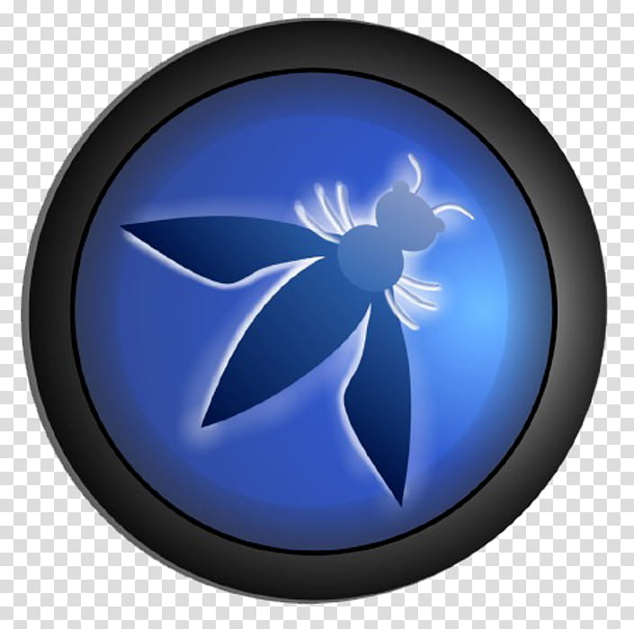

<!---
<h1 align="center">Hi 👋, I'm Biswajit Rout</h1>
<h3 align="center">A Growing Backend Developer | Cybersecurity Enthusiast</h3>

- 🔭 I’m currently working on **Backend & Cybersecurity Tool Devlopment**

- 🌱 I’m currently learning **BUG Hunting | Backend Development**

- 👯 I’m looking to collaborate on **Tool Development | Backend Project**

- 🤝 Build in public **on Twitter/X and Linkedin**

- 📝 Find my top projects [https://github.com/rout369](https://github.com/rout369)

- ⚡ Quote of my life: Never Give Up and some time you have to run before you learn walk..

<h3 align="left">Connect with me:</h3>

   

<h3 align="left">Languages and Tools:</h3>

  
  
  
  
  
  
  
  
   
   
    
    
  
   
  
  
  

--->

<!---

 align="left" src="https://github-readme-stats.vercel.app/api/top-langs?username=rout369&show_icons=true&locale=en&layout=compact&bg_color=000000" alt="rout369" />

&nbsp;

--->
<!---

--->
<!---

--->

<!---

  
  

--->

<!---
rout369/rout369 is a ✨ special ✨ repository because its `README.md` (this file) appears on your GitHub profile.
You can click the Preview link to take a look at your changes.
--->

<h1 align="center">Hi 👋, I'm Biswajit Rout</h1>
<h3 align="center">Backend Developer | Cybersecurity Enthusiast</h3>

## 🚀 About Me
- 🔭 Currently working on **Backend & Cybersecurity Tool Development**  
- 🌱 Learning **Bug Hunting** and **Advanced Backend Development**  
- 👯 Open to collaborating on **Tool Development & Backend Projects**  
- 📢 Building in public on **[Twitter/X](https://x.com/Vishal848957001)** and **[LinkedIn](https://www.linkedin.com/in/biswajit-rout-9b2386258/)**  
- 📝 Check out my projects: [GitHub Profile](https://github.com/rout369)  
- ⚡ **Life Quote:** *Never give up; sometimes you have to run before you learn to walk.*  

## 🏆 Achievements

<!---
## 📬 Connect With Me

  
  
  
  
  

--->
## 📬 Connect With Me

## 🛠️ Skills & Tools

**Programming & Scripting**  
       

**Frontend Development**  
     

**Backend & Databases**  
      

**Cybersecurity & Networking**  
       

**Tools & Platforms**  
       

## 📊 GitHub Stats

  
  

## 🔥 Streaks & Badges

  
  

